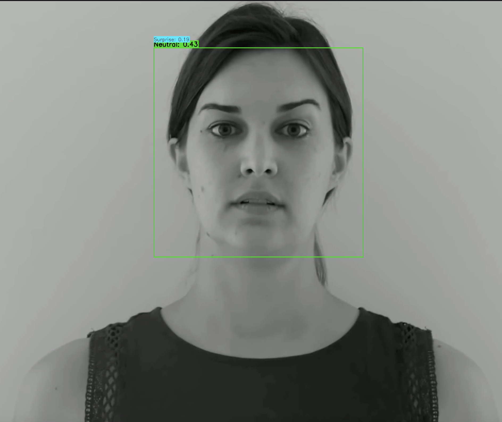

# Facial Expression Classification

A TensorFlow CNN and OpenCV pipeline for classifying facial expressions in webcam feeds and video files. The model is trained on FER2013’s seven labels: Angry, Disgust, Fear, Happy, Sad, Surprise, and Neutral.

## Demo



[Input video](emotion1.mp4) · [Annotated output video](emotion1_processed.mp4) · [Implementation notebook](facial_emotion_detection.ipynb)

## Setup

From the repository root, create a Python environment and install the notebook dependencies:

```bash
python3 -m venv .venv
source .venv/bin/activate
python -m pip install numpy pandas tensorflow opencv-python jupyter
jupyter notebook facial_emotion_detection.ipynb
```

The dataset and trained model files are not included. Place the FER2013 CSV at `fer2013.csv` in the repository root before training. Video and webcam inference require `checkpoints/best_model.h5`.

## Training

Run the notebook’s imports and function-definition cells, then train with:

```python
model, history = train_model(continue_training=False)
```

Training uses data augmentation, early stopping, learning-rate reduction, and a best-model checkpoint. Set `continue_training=True` to resume from an existing checkpoint.

The notebook uses FER2013’s `Training` partition for fitting and `PrivateTest` as validation data during training. Those validation results should not be presented as an independent held-out test benchmark.

## Inference

After training or supplying a compatible checkpoint, run either example in the notebook:

```python
process_video('emotion1.mp4', 'emotion1_annotated.mp4')
```

```python
start_webcam_detection()
```

Replace the notebook’s existing `./videos/...` and `./output/...` example paths with files and directories on your machine. OpenCV displays a window with face boxes and the top two predicted labels; press `q` to stop. The webcam mode also displays an FPS counter.

## Model

- Three convolution blocks with batch normalization, max pooling, and dropout.
- Dense layers with 512 and 256 units.
- Seven-class softmax output.
- OpenCV Haar-cascade face detection and 48 × 48 grayscale model input.

The predictions describe the model’s facial-expression labels; they do not establish a person’s internal emotional state. Results depend on lighting, framing, and the training data.

## Credits

Code by **Sreeram Kondapalli** and **Caleb Musfeldt**. Built with TensorFlow, OpenCV, and the FER2013 dataset.
